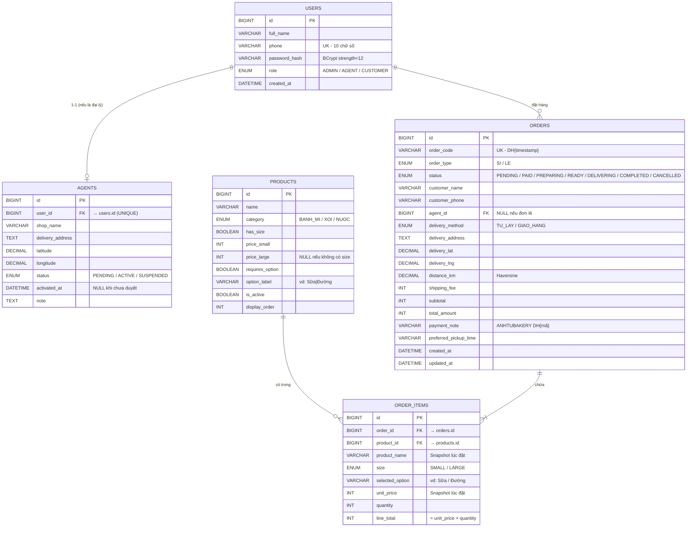

# Tài Liệu Thiết Kế Cơ Sở Dữ Liệu
## Anh Tu Bakery — Hệ Thống Quản Lý Bán Sỉ & Bán Lẻ

---

## 1. Tổng quan

Hệ thống sử dụng **MySQL / PostgreSQL** (H2 cho môi trường test), truy vấn thông qua **Spring Data JPA** với Parameterized Query — không ghép chuỗi SQL thủ công. Toàn bộ tham số nghiệp vụ (giá sỉ, bán kính phục vụ, phí ship) được cấu hình tập trung trong `application.yml`, không hardcode trong source code.

---

## 2. Sơ đồ ERD (Mermaid)



---

## 3. Mô tả chi tiết từng bảng

### 3.1 Bảng `users`

Lưu toàn bộ tài khoản của hệ thống, phân biệt qua trường `role`.

| Cột | Kiểu | Ràng buộc | Mô tả |
|-----|------|-----------|-------|
| `id` | BIGINT | PK, AUTO_INCREMENT | Khóa chính |
| `full_name` | VARCHAR(100) | NOT NULL | Họ tên đại diện |
| `phone` | VARCHAR(10) | NOT NULL, UNIQUE | Số điện thoại 10 chữ số — dùng làm username đăng nhập |
| `password_hash` | VARCHAR(255) | NOT NULL | BCrypt strength=12 |
| `role` | ENUM | NOT NULL | `ADMIN` / `AGENT` / `CUSTOMER` |
| `created_at` | DATETIME | NOT NULL | Thời điểm tạo tài khoản |

---

### 3.2 Bảng `agents`

Thông tin mở rộng cho tài khoản có `role = AGENT`. Quan hệ 1-1 với `users`.

| Cột | Kiểu | Ràng buộc | Mô tả |
|-----|------|-----------|-------|
| `id` | BIGINT | PK | |
| `user_id` | BIGINT | FK → users.id, UNIQUE | Liên kết tài khoản |
| `shop_name` | VARCHAR(150) | NOT NULL | Tên cửa hàng / đại lý |
| `delivery_address` | TEXT | NOT NULL | Địa chỉ giao hàng sỉ |
| `latitude` | DECIMAL(10,7) | NOT NULL | Vĩ độ — dùng tính khoảng cách Haversine |
| `longitude` | DECIMAL(10,7) | NOT NULL | Kinh độ — dùng tính khoảng cách Haversine |
| `status` | ENUM | NOT NULL, DEFAULT 'PENDING' | `PENDING` / `ACTIVE` / `SUSPENDED` |
| `activated_at` | DATETIME | NULLABLE | Thời điểm Admin kích hoạt |
| `note` | TEXT | NULLABLE | Ghi chú nội bộ của Admin |

**Chuyển trạng thái hợp lệ:**

```
PENDING ──(Admin kích hoạt)──► ACTIVE ──(Admin tạm khóa)──► SUSPENDED
                                  ▲                               │
                                  └──────(Admin mở khóa)──────────┘
```

---

### 3.3 Bảng `products`

Danh mục sản phẩm. Admin bật/tắt hiển thị và điều chỉnh giá qua bảng này.

| Cột | Kiểu | Ràng buộc | Mô tả |
|-----|------|-----------|-------|
| `id` | BIGINT | PK | |
| `name` | VARCHAR(150) | NOT NULL | Tên sản phẩm |
| `category` | ENUM | NOT NULL | `BANH_MI` / `XOI` / `NUOC` |
| `has_size` | BOOLEAN | NOT NULL, DEFAULT false | Có lựa chọn size không |
| `price_small` | INT | NOT NULL | Giá hộp nhỏ / ly nhỏ (VNĐ) |
| `price_large` | INT | NULLABLE | Giá hộp lớn / ly lớn — NULL nếu không có size |
| `requires_option` | BOOLEAN | NOT NULL, DEFAULT false | Bắt buộc chọn tùy chọn |
| `option_label` | VARCHAR(100) | NULLABLE | Nhãn tùy chọn, vd: `Sữa\|Đường` |
| `is_active` | BOOLEAN | NOT NULL, DEFAULT true | Admin bật/tắt hiển thị trên menu |
| `display_order` | INT | NOT NULL, DEFAULT 0 | Thứ tự hiển thị |

**Ví dụ dữ liệu mẫu:**

| name | category | has_size | price_small | price_large | requires_option | option_label |
|------|----------|----------|-------------|-------------|-----------------|--------------|
| Bánh mì Bơ đậu | BANH_MI | false | 15000 | NULL | true | Sữa\|Đường |
| Sữa đậu | NUOC | true | 5000 | 10000 | false | NULL |
| Xôi Trứng | XOI | true | 10000 | 15000 | false | NULL |

---

### 3.4 Bảng `orders`

Đơn hàng của cả hai phân hệ sỉ và lẻ, phân biệt qua `order_type`.

| Cột | Kiểu | Ràng buộc | Mô tả |
|-----|------|-----------|-------|
| `id` | BIGINT | PK | |
| `order_code` | VARCHAR(20) | NOT NULL, UNIQUE | Mã đơn dạng `DH{timestamp}` |
| `order_type` | ENUM | NOT NULL | `SI` (sỉ) / `LE` (lẻ) |
| `status` | ENUM | NOT NULL | Xem bảng trạng thái bên dưới |
| `customer_name` | VARCHAR(100) | NOT NULL | Họ tên người đặt |
| `customer_phone` | VARCHAR(10) | NOT NULL | Số điện thoại liên hệ |
| `agent_id` | BIGINT | FK → agents.id, NULLABLE | Điền nếu đơn sỉ |
| `delivery_method` | ENUM | NULLABLE | `TU_LAY` / `GIAO_HANG` (chỉ đơn lẻ) |
| `delivery_address` | TEXT | NULLABLE | Địa chỉ giao (nếu chọn GIAO_HANG) |
| `delivery_lat` | DECIMAL(10,7) | NULLABLE | Vĩ độ giao hàng |
| `delivery_lng` | DECIMAL(10,7) | NULLABLE | Kinh độ giao hàng |
| `distance_km` | DECIMAL(6,3) | NULLABLE | Khoảng cách tính bằng Haversine (km) |
| `shipping_fee` | INT | NOT NULL, DEFAULT 0 | Phí giao hàng (VNĐ) — đơn sỉ luôn = 0 |
| `subtotal` | INT | NOT NULL | Tổng tiền hàng (chưa ship) |
| `total_amount` | INT | NOT NULL | = subtotal + shipping_fee |
| `payment_note` | VARCHAR(100) | NULLABLE | Nội dung chuyển khoản: `ANHTUBAKERY DH{mã}` |
| `preferred_pickup_time` | VARCHAR(50) | NULLABLE | Khung giờ dự kiến lấy (đơn tự lấy) |
| `created_at` | DATETIME | NOT NULL | |
| `updated_at` | DATETIME | NOT NULL | |

**Bảng trạng thái đơn hàng:**

| Trạng thái | Mô tả | Chuyển tiếp hợp lệ |
|------------|-------|-------------------|
| `PENDING` | Vừa đặt, chờ thanh toán | → `PAID` (Admin xác nhận) / → `CANCELLED` |
| `PAID` | Đã thanh toán, chờ làm | → `PREPARING` |
| `PREPARING` | Đang chuẩn bị | → `READY` |
| `READY` | Xong, chờ lấy / chờ ship | → `COMPLETED` hoặc → `DELIVERING` |
| `DELIVERING` | Đang giao (chỉ GIAO_HANG) | → `COMPLETED` |
| `COMPLETED` | Hoàn thành | — Kết thúc — |
| `CANCELLED` | Hủy (Admin xử lý thủ công) | — Kết thúc — |

---

### 3.5 Bảng `order_items`

Chi tiết từng dòng sản phẩm trong đơn. Lưu snapshot tên và giá tại thời điểm đặt để tránh sai lệch khi Admin cập nhật giá sau này.

| Cột | Kiểu | Ràng buộc | Mô tả |
|-----|------|-----------|-------|
| `id` | BIGINT | PK | |
| `order_id` | BIGINT | FK → orders.id, NOT NULL | |
| `product_id` | BIGINT | FK → products.id, NOT NULL | |
| `product_name` | VARCHAR(150) | NOT NULL | **Snapshot** tên sản phẩm lúc đặt |
| `size` | ENUM | NULLABLE | `SMALL` / `LARGE` |
| `selected_option` | VARCHAR(50) | NULLABLE | Vd: `Sữa` hoặc `Đường` |
| `unit_price` | INT | NOT NULL | **Snapshot** đơn giá lúc đặt |
| `quantity` | INT | NOT NULL | Số lượng |
| `line_total` | INT | NOT NULL | = unit_price × quantity |

> **Lý do snapshot:** Khi Admin điều chỉnh giá sản phẩm, các đơn hàng cũ vẫn giữ đúng giá trị thanh toán ban đầu để đối soát chính xác.

---

## 4. Quan hệ giữa các bảng

```
users (1) ──────────── (0..1) agents
  │
  └── (1) ──────────── (0..N) orders
                                │
                                └── (1) ──────────── (1..N) order_items
                                                              │
                                                              └── (N) ── (1) products
```

**Tóm tắt:**
- Mỗi `user` có thể có 0 hoặc 1 bản ghi `agents` (nếu là đại lý).
- Mỗi `user` có thể đặt nhiều `orders`.
- Mỗi `order` chứa ít nhất 1 `order_item`.
- Mỗi `order_item` tham chiếu đến 1 `product`.

---

## 5. Tham số nghiệp vụ trong `application.yml`

Toàn bộ ngưỡng giá và cấu hình vùng phục vụ được đặt ở đây, không hardcode:

```yaml
bakery:
  location:
    latitude: 15.1234567       # Tọa độ lò bánh
    longitude: 108.9876543

  wholesale:
    min-quantity: 50           # Tối thiểu 50 ổ/đơn sỉ
    tier1-max-quantity: 199
    tier1-price: 1500          # 50–199 ổ: 1.500đ/ổ
    tier2-price: 1300          # ≥200 ổ: 1.300đ/ổ
    max-delivery-radius-km: 5.0

  shipping:                    # Phí giao hàng lẻ (lũy tiến)
    base-fee: 10000            # 0–2 km: 10.000đ cố định
    tier2-start-km: 2.0
    tier2-rate: 3500           # 2–5 km: +3.500đ/km
    tier3-start-km: 5.0
    tier3-rate: 4000           # 5–10 km: +4.000đ/km
    tier4-start-km: 10.0
    tier4-rate: 5000           # >10 km: +5.000đ/km
    warning-distance-km: 50.0

  admin:
    phone: "0779409567"
```

---

## 6. Phí giao hàng — Bảng tra nhanh

### Đơn lẻ (lũy tiến theo km)

| Khoảng cách | Công thức | Ví dụ (3 km) |
|-------------|-----------|--------------|
| 0 – 2 km | 10.000đ (cố định) | 10.000đ |
| 2 – 5 km | 10.000 + (d – 2) × 3.500 | 13.500đ |
| 5 – 10 km | 10.000 + 3 × 3.500 + (d – 5) × 4.000 | — |
| > 10 km | 10.000 + 3 × 3.500 + 5 × 4.000 + (d – 10) × 5.000 | — |

### Đơn sỉ

Miễn phí giao hàng (0đ) cho mọi đơn trong phạm vi 5 km. Không nhận đơn ngoài 5 km.

---

## 7. Giá sỉ bậc thang

| Số lượng (ổ/đơn) | Đơn giá | Ghi chú |
|------------------|---------|---------|
| < 50 | — | Từ chối đơn, trả lỗi 400 |
| 50 – 199 | **1.500đ/ổ** | TIER_1 |
| ≥ 200 | **1.300đ/ổ** | TIER_2 |

Hệ thống hiển thị gợi ý: nếu đơn đang ở TIER_1 và chỉ cần thêm ≤ 50 ổ để lên TIER_2, frontend sẽ tính và hiển thị số tiền tiết kiệm được.

---

## 8. Chỉ mục đề xuất (Indexes)

```sql
-- Tra cứu tài khoản theo số điện thoại (đăng nhập)
CREATE UNIQUE INDEX idx_users_phone ON users(phone);

-- Tra cứu đơn hàng theo mã đơn
CREATE UNIQUE INDEX idx_orders_code ON orders(order_code);

-- Lọc đơn theo trạng thái (Admin dashboard)
CREATE INDEX idx_orders_status ON orders(status);

-- Lọc đơn theo loại (báo cáo sỉ/lẻ)
CREATE INDEX idx_orders_type_date ON orders(order_type, created_at);

-- Lấy chi tiết đơn hàng
CREATE INDEX idx_order_items_order ON order_items(order_id);
```

---

## 9. Câu truy vấn phục vụ báo cáo

### Doanh thu theo tháng, phân loại sỉ/lẻ (Chart.js)

```sql
SELECT
    order_type,
    MONTH(created_at)  AS thang,
    YEAR(created_at)   AS nam,
    SUM(total_amount)  AS doanh_thu,
    COUNT(id)          AS so_don
FROM orders
WHERE status = 'COMPLETED'
GROUP BY order_type, YEAR(created_at), MONTH(created_at)
ORDER BY nam, thang;
```

### Top sản phẩm bán chạy

```sql
SELECT
    oi.product_name,
    SUM(oi.quantity)   AS tong_so_luong,
    SUM(oi.line_total) AS tong_doanh_thu
FROM order_items oi
JOIN orders o ON oi.order_id = o.id
WHERE o.status = 'COMPLETED'
GROUP BY oi.product_name
ORDER BY tong_so_luong DESC
LIMIT 10;
```

### Danh sách đại lý chờ duyệt

```sql
SELECT
    u.full_name,
    u.phone,
    a.shop_name,
    a.delivery_address,
    a.latitude,
    a.longitude,
    a.status,
    u.created_at
FROM agents a
JOIN users u ON a.user_id = u.id
WHERE a.status = 'PENDING'
ORDER BY u.created_at ASC;
```