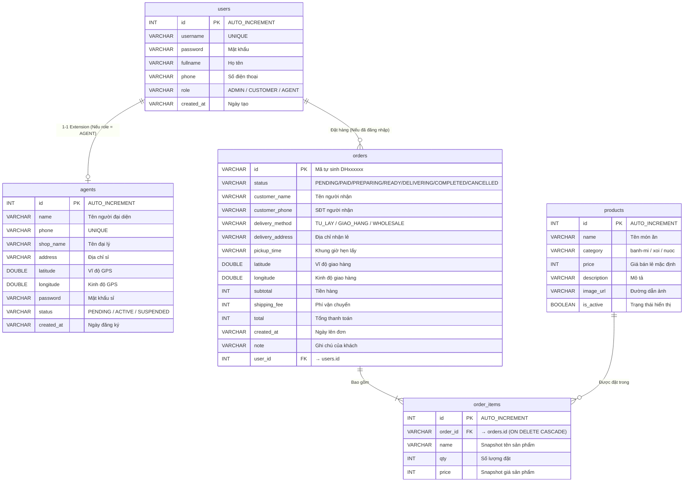

# TÀI LIỆU KHẢO SÁT & TỔNG HỢP CHI TIẾT DỰ ÁN — ANH TU BAKERY
*(Hệ Thống Tích Hợp Bán Sỉ & Bán Lẻ Lò Bánh Mì)*

---

## 1. GIỚI THIỆU TỔNG QUAN DỰ ÁN
**Anh Tu Bakery** là một ứng dụng web tích hợp quản lý và vận hành cho cả hai mô hình kinh doanh thực tế của lò bánh mì gia đình:
*   **Phân hệ Bán Sỉ (Lò Bánh Mì Anh Tú)**: Cung cấp mì ổ không nhân cho các đại lý ẩm thực (quán cơm, tiệm bánh mì kẹp nhỏ, bếp ăn trường học) trong phạm vi bán kính phục vụ tối đa **5km**. Phân hệ này áp dụng chính sách **giá sỉ bậc thang** tự động theo số lượng đặt hàng và miễn phí giao hàng tận nơi.
*   **Phân hệ Bán Lẻ (Quán Bánh Mì Của Mẹ)**: Bán lẻ các món ăn sáng đường phố bao gồm bánh mì kẹp nhân (heo quay, thịt nướng, trứng...), xôi nóng các loại và nước uống tự nấu (sữa đậu nành tươi). Hệ thống hỗ trợ khách đặt hàng online với hai tùy chọn nhận hàng: **Tự đến lấy tại quán** (hẹn giờ nhận món) hoặc **Giao hàng tận nơi** (phí vận chuyển tính lũy tiến theo số km thực tế).

### Các Nhóm Đối Tượng Sử Dụng (Actors):
1.  **Quản trị viên (Admin)**: Người vận hành tiệm bánh (Mẹ hoặc người thân). Admin quản lý toàn bộ vòng đời đơn hàng, cập nhật trạng thái chế biến thời gian thực, duyệt tài khoản đại lý sỉ mới, bật/tắt hiển thị món ăn trên thực đơn và xem tổng hợp số liệu doanh thu trực quan.
2.  **Đại lý (Agent)**: Khách hàng mua sỉ mì ổ với số lượng lớn ($\ge 50$ ổ). Đại lý đăng ký tài khoản trực tuyến cung cấp tọa độ GPS, chờ Admin xác minh kích hoạt mới có thể đăng nhập lên đơn sỉ.
3.  **Khách lẻ (Customer)**: Người mua bánh mì kẹp, xôi, nước uống. Khách có thể đặt hàng trực tiếp (không bắt buộc đăng nhập) hoặc tạo tài khoản khách hàng lẻ để lưu lịch sử giao dịch và thông tin cá nhân.

---

## 2. KIẾN TRÚC HỆ THỐNG & CÔNG NGHỆ THỰC TẾ TRONG MÃ NGUỒN

> [!IMPORTANT]
> **Lưu ý quan trọng về sự khác biệt giữa thiết kế lý thuyết và mã nguồn:**
> Các tài liệu thiết kế ban đầu (`01.system_architecture.md` -> `05.admin_analystic.md`) mô tả dự án sử dụng *Spring Boot, Spring Data JPA, và Server-Sent Events (SSE)*.
> Tuy nhiên, trong mã nguồn thực tế, dự án được xây dựng bằng công nghệ **Jakarta EE 11 (Servlet/JSP)** chạy trên các Servlet Container (như Apache Tomcat 11) kết hợp với **Weld CDI** để quản lý Dependency Injection và giao tiếp với CSDL qua **JDBC thuần (DriverManager/DataSource)**. Thay vì dùng SSE, hệ thống sử dụng **WebSocket** để cập nhật trạng thái đơn hàng thời gian thực.
> Đồng thời, các tính toán về khoảng cách (Haversine) và phí vận chuyển được thực hiện ở client-side bằng Javascript để giảm tải cho server, sau đó truyền kết quả lưu trữ vào backend qua các Servlet API.

### Sơ đồ kiến trúc thực tế của hệ thống:
```
┌────────────────────────────────────────────────────────────────────────┐
│                          CLIENT SIDE (Browser)                         │
│   - JSP rendering view (index, menu, order, track, wholesale, profile) │
│   - Client logic (JavaScript): Cart management, Geolocation API,      │
│     Haversine Distance, Progressive Shipping Fee Calculation          │
│   - WebSocket client (track.jsp connection using standard WS API)      │
└──────────────────────────────────┬─────────────────────────────────────┘
                                   │ HTTP API / JSON / WebSocket Connection
┌──────────────────────────────────▼─────────────────────────────────────┐
│                          CONTROLLER LAYER                              │
│   - Servlets: AuthServlet, OrderServlet, AgentServlet, ProductServlet, │
│     AdminCustomerServlet                                               │
│   - WebSocket Endpoint: OrderWebSocket (@ServerEndpoint)               │
└──────────────────────────────────┬─────────────────────────────────────┘
                                   │ Jakarta CDI (@Inject)
┌──────────────────────────────────▼─────────────────────────────────────┐
│                           BUSINESS SERVICE                             │
│   - Service classes: OrderService, ProductService...                  │
│     (Annotated with @ApplicationScoped, injected into controllers)     │
└──────────────────────────────────┬─────────────────────────────────────┘
                                   │ JDBC Commands / Statements
┌──────────────────────────────────▼─────────────────────────────────────┐
│                           DATA ACCESS LAYER                            │
│   - DAOs: UserDAO, AgentDAO, ProductDAO, OrderDAO                      │
│     (Direct SQL execution via PreparedStatement, dynamic queries)      │
└──────────────────────────────────┬─────────────────────────────────────┘
                                   │ Database connections (JNDI / JDBC)
┌──────────────────────────────────▼─────────────────────────────────────┐
│                     PERSISTENCE LAYER (DATABASE)                       │
│   - Dynamic compatibility: H2 (default), MySQL, or MS SQL Server      │
│   - Managed by DatabaseHelper (Automatic table creation & seeding)     │
└────────────────────────────────────────────────────────────────────────┘
```

### Các Kỹ Thuật Chính Được Sử Dụng:
1.  **Jakarta Servlet 6.0 & JSP 3.1**: Định tuyến HTTP và xử lý nghiệp vụ ở server-side thông qua các annotations như `@WebServlet`. JSP được cấu hình với JSTL để render giao diện động.
2.  **Dependency Injection (Jakarta CDI 4.0 - JBoss Weld)**: Sử dụng Weld Servlet để tiêm phụ thuộc (`@Inject`) các lớp Service và DAO, giúp tách biệt mã nguồn điều khiển (Controller), xử lý nghiệp vụ (Service) và truy cập dữ liệu (DAO). Các Bean nghiệp vụ được đặt phạm vi `@ApplicationScoped`.
3.  **Hỗ trợ đa Cơ sở dữ liệu động (Multi-Database Support)**: Lớp `DatabaseHelper` tự động phân tích Driver và tên CSDL kết nối từ JDBC URL. Nó có hai khối lệnh khởi tạo bảng riêng biệt:
    *   *Khối MySQL & H2*: Sử dụng cú pháp `CREATE TABLE IF NOT EXISTS`, kiểu dữ liệu `AUTO_INCREMENT`, `DOUBLE` và `BOOLEAN`.
    *   *Khối MS SQL Server*: Sử dụng cú pháp kiểm tra `IF OBJECT_ID('table', 'U') IS NULL`, kiểu dữ liệu `IDENTITY(1,1)`, `NVARCHAR`, `DOUBLE PRECISION` và `BIT`.
    *   Hệ thống sẽ tự động thêm/bù đắp cột (ví dụ: `ALTER TABLE orders ADD note VARCHAR(500)`) khi phát hiện CSDL cũ thiếu trường, bảo toàn tính tương thích ngược.
4.  **Jakarta WebSocket 2.1**: Lớp `OrderWebSocket` được ánh xạ tại `/order-ws/{orderId}`. Kết nối được quản lý thông qua cấu trúc `ConcurrentHashMap` lưu trữ tập hợp phiên làm việc (`Set<Session>`) cho từng ID đơn hàng cụ thể, cho phép một khách hàng mở nhiều tab hoặc thiết bị vẫn nhận được thông tin cập nhật đồng bộ cùng lúc.
5.  **Jakarta JSON Binding (JSON-B)**: Sử dụng `JsonbBuilder.create()` làm thư viện chính để tuần tự hóa (serialize) các thực thể Java thành chuỗi JSON và ngược lại, giao tiếp trực tiếp với client thông qua Fetch API của Javascript.

---

## 3. SƠ ĐỒ CƠ SỞ DỮ LIỆU & THỰC THỂ (ERD & SCHEMA)

### 3.1 Sơ đồ mối quan hệ thực thể (Mermaid ERD)


### 3.2 Đặc Tả Schema Chi Tiết & Ràng Buộc
1.  **Bảng `users`**: Lưu trữ thông tin tài khoản người dùng trong hệ thống. Cột `username` đóng vai trò duy nhất (`UNIQUE`).
2.  **Bảng `agents`**: Lưu trữ thông tin đại lý bán sỉ. Có mối quan hệ logic 1-1 với `users` (dựa trên trường `phone` kết nối làm cầu nối tài khoản). Cột `status` nhận một trong ba giá trị mặc định: `PENDING` (chờ duyệt), `ACTIVE` (đang hoạt động), `SUSPENDED` (bị khóa tạm thời).
3.  **Bảng `products`**: Danh mục các sản phẩm bánh mì, xôi, nước uống. Admin có thể cập nhật trạng thái `is_active` để ẩn sản phẩm khỏi thực đơn mà không cần xóa vật lý bản ghi.
4.  **Bảng `orders`**: Lưu trữ thông tin đơn hàng sỉ và lẻ.
    *   Trường `delivery_method` lưu giá trị phân loại: `TU_LAY` (Khách tự đến lấy lẻ), `GIAO_HANG` (Giao lẻ tận nhà) hoặc `WHOLESALE` (Đơn đặt sỉ của đại lý).
    *   Trường `pickup_time` lưu trữ mã khung giờ hẹn khách đến lấy: `SANG_SOM`, `SANG`, `TRUA`, `CHIEU`.
5.  **Bảng `order_items`**: Lưu trữ chi tiết mặt hàng trong hóa đơn.
    *   *Kỹ thuật Snapshot*: Lưu trữ trực tiếp tên sản phẩm (`name`) và đơn giá tại thời điểm đặt (`price`). Điều này ngăn ngừa sự thay đổi số liệu doanh thu trong quá khứ khi Admin cập nhật giá hoặc đổi tên món ăn trong bảng `products`.
    *   Ràng buộc khóa ngoại: Liên kết đến `orders(id)` đi kèm cấu hình `ON DELETE CASCADE`. Khi xóa đơn hàng, các chi tiết đơn hàng tương ứng sẽ được tự động dọn dẹp khỏi CSDL.

### 3.3 Cơ Chế Seeding Dữ Liệu Tự Động
Khi ứng dụng khởi chạy lần đầu tiên và kết nối vào CSDL trống, lớp `DatabaseHelper` sẽ tự động kích hoạt tiến trình nạp dữ liệu mẫu (Seeding):
*   **Seed Tài Khoản**:
    *   Tài khoản Admin: `username` = `"admin"`, `password` = `"admin123"`, `fullname` = `"Quản trị viên"`, `role` = `"ADMIN"`.
    *   Tài khoản Khách Hàng Demo: `username` = `"user"`, `password` = `"user123"`, `fullname` = `"Khách Hàng Thử Nghiệm"`, `phone` = `"0779409567"`, `role` = `"CUSTOMER"`.
*   **Seed Thực Đơn (Products)**: Nạp sẵn 8 loại bánh mì kẹp (giá 10.000đ - 13.000đ), 5 loại xôi nóng (giá 10.000đ - 15.000đ) và sản phẩm Sữa đậu nành tươi (5.000đ).
*   **Seed Đơn Hàng Demo**: Tạo sẵn đơn hàng mã `DH00000001` ở trạng thái `PREPARING` của khách hàng tên "Nguyễn Văn A" (SĐT: `0912345678`), địa chỉ tại Huế kèm theo 3 món ăn mẫu để lập tức hiển thị trên trang theo dõi trạng thái.

---

## 4. CÁC THUẬT TOÁN CỐT LÕI CỦA HỆ THỐNG

### 4.1 Thuật Toán Khoảng Cách Địa Lý (Haversine Formula)
Dùng để tính khoảng cách đường thẳng (theo đường chim bay) giữa hai điểm tọa độ trên bề mặt Trái Đất dựa vào vĩ độ (latitude) và kinh độ (longitude). Thuật toán này được triển khai ở phía Client (tệp [order.js](file:///d:/code%20java/Test/Bakery/src/main/webapp/js/order.js) và trang [wholesale.jsp](file:///d:/code%20java/Test/Bakery/src/main/webapp/view/wholesale.jsp)).

#### Công thức toán học:
$$a = \sin^2\left(\frac{\Delta \text{lat}}{2}\right) + \cos(\text{lat}_1) \cdot \cos(\text{lat}_2) \cdot \sin^2\left(\frac{\Delta \text{lon}}{2}\right)$$
$$c = 2 \cdot \text{atan2}\left(\sqrt{a}, \sqrt{1-a}\right)$$
$$d = R \cdot c$$
*Trong đó:*
*   $R = 6371$ (Bán kính Trái Đất trung bình tính bằng km).
*   $\Delta \text{lat} = \text{lat}_2 - \text{lat}_1$ (quy đổi sang Radian).
*   $\Delta \text{lon} = \text{lon}_2 - \text{lon}_1$ (quy đổi sang Radian).

#### Triển khai code JavaScript thực tế:
```javascript
function haversine(lat1, lon1, lat2, lon2) {
    const R = 6371; // km
    const dLat = toRad(lat2 - lat1);
    const dLon = toRad(lon2 - lon1);
    const a = Math.sin(dLat/2)**2 + 
              Math.cos(toRad(lat1)) * Math.cos(toRad(lat2)) * 
              Math.sin(dLon/2)**2;
    return R * 2 * Math.atan2(Math.sqrt(a), Math.sqrt(1-a));
}
function toRad(deg) { return deg * Math.PI / 180; }
```

---

### 4.2 Thuật Toán Tính Phí Giao Hàng Lũy Tiến (Progressive Shipping Fee)
Phí vận chuyển lẻ được tính toán dựa trên khoảng cách $d$ (km) thu được từ công thức Haversine. Phí ship áp dụng cơ chế lũy tiến tăng dần theo cự ly và làm tròn lên đến **500 VNĐ** gần nhất để phù hợp với thanh toán thực tế tại Việt Nam.

#### Công thức phân chặng phí:
$$\text{Fee}(d) = \begin{cases} 
10.000 & \text{nếu } d \le 2.0\text{ km} \\
10.000 + (d - 2.0) \times 3.500 & \text{nếu } 2.0 < d \le 5.0\text{ km} \\
20.500 + (d - 5.0) \times 4.000 & \text{nếu } 5.0 < d \le 10.0\text{ km} \\
40.500 + (d - 10.0) \times 5.000 & \text{nếu } d > 10.0\text{ km} 
\end{cases}$$

#### Công thức làm tròn:
$$\text{Fee}_{\text{final}} = \text{Math.ceil}(\text{Fee} / 500) \times 500$$

*Ví dụ:* Khoảng cách tính toán là $3.5\text{ km}$:
$$\text{Fee} = 10.000 + (3.5 - 2.0) \times 3.500 = 15.250\text{ VNĐ}$$
$$\text{Fee}_{\text{final}} = \text{Math.ceil}(15.250 / 500) \times 500 = 31 \times 500 = 15.500\text{ VNĐ}$$

---

### 4.3 Thuật Toán Tính Giá Sỉ Bậc Thang (Wholesale Tier Pricing)
Mức giá sỉ cho mỗi đơn hàng mì ổ không nhân được tính toán dựa trên số lượng ổ $q$ đặt mua trong một đơn hàng sỉ đơn lẻ:
*   $q < 50$ ổ: **Từ chối tạo đơn sỉ**. Hệ thống hiển thị cảnh báo yêu cầu đặt mua lẻ tại trang đặt hàng thông thường.
*   $50 \le q \le 199$ ổ: Đơn giá áp dụng là **1.500 VNĐ / ổ** (Bậc 1).
*   $q \ge 200$ ổ: Đơn giá áp dụng tốt nhất là **1.300 VNĐ / ổ** (Bậc 2).

#### Cơ Chế Gợi Ý Tối Ưu Chi Phí (Upgrade Hint):
Nếu đại lý nhập số lượng nằm trong phạm vi Bậc 1 ($50 \le q < 200$), hệ thống sẽ tự động tính toán số lượng cần mua thêm để đạt mốc Bậc 2 và số tiền tiết kiệm được so với việc mua số lượng hiện tại, khuyến khích nâng cấp đơn hàng:
$$\text{Loaves}_{\text{needed}} = 200 - q$$
$$\text{Savings} = (q \times 1.500) - (q \times 1.300) = q \times 200\text{ VNĐ}$$
*Ví dụ:* Đại lý nhập $180$ ổ. Hệ thống hiển thị: *“💡 Đặt thêm 20 ổ $\rightarrow$ giá 1.300đ/ổ, tiết kiệm được 36.000đ!”*

---

## 5. LUỒNG XỬ LÝ NGHIỆP VỤ & CÁC THAY ĐỔI MỚI NHẤT

### 5.1 Quy Trình Đăng Ký & Kích Hoạt Đại Lý (Wholesale Agent)
```
[Đại lý gửi form đăng ký + Tọa độ GPS tự động] 
       │
       ▼
[Tài khoản được tạo với trạng thái PENDING]
       │
       ▼ (Quy trình bên ngoài hệ thống)
[Admin gọi điện xác minh đại lý, kiểm tra bán kính ≤ 5km]
       │
       ▼
[Admin bấm duyệt kích hoạt trên trang quản trị]
       │
       ▼
[Trạng thái chuyển sang ACTIVE ── Đại lý có thể đăng nhập lên đơn sỉ]
```

---

### 5.2 Quy Trình Đặt Hàng Bán Lẻ
1.  **Lựa chọn sản phẩm**: Khách chọn món trên thực đơn.
    *   Nếu chọn *Bánh mì bơ đậu*: Hệ thống kích hoạt thuộc tính bắt buộc, yêu cầu khách click chọn tùy chọn **Sữa** hoặc **Đường** (lưu vào `selected_option`) mới cho phép click nút thêm vào giỏ.
    *   Nếu chọn *Xôi* hoặc *Nước uống*: Khách chọn size (Hộp/Ly nhỏ hoặc lớn) để hiển thị đúng giá tiền tương ứng.
2.  **Lựa chọn hình thức nhận hàng**:
    *   *Tự đến lấy tại quán*: Khách cung cấp Họ tên, SĐT và chọn một trong các khung giờ hẹn lấy: Sáng sớm, Sáng, Trưa, Chiều. Phí giao hàng đặt cố định bằng 0 VNĐ.
    *   *Giao hàng tận nơi*: Khách cung cấp thông tin liên hệ và địa chỉ cụ thể. Hệ thống gọi OpenStreetMap API để lấy tọa độ kinh/vĩ độ, áp dụng công thức Haversine để tính khoảng cách và áp dụng thuật toán lũy tiến để hiện phí ship ngay trên màn hình.

---

### 5.3 Chi Tiết Các Thay Đổi Cập Nhật Code Mới Nhất
Mã nguồn dự án vừa qua đã được tối ưu hóa và bổ sung các tính năng quan trọng sau:

1.  **Chuyển Đổi Bản Đồ Sang Khung Giờ Thực Tế (Pickup Time Slot Mapping)**:
    Khi khách lẻ chọn hình thức tự đến lấy (`TU_LAY`), thông tin giờ hẹn được lưu dưới các mã khóa (`SANG_SOM`, `SANG`, `TRUA`, `CHIEU`). Tại trang Admin Dashboard ([admin_dashboard.jsp](file:///d:/code%20java/Test/Bakery/src/main/webapp/view/admin_dashboard.jsp)), hệ thống đã được cập nhật đoạn mã phân tích dữ liệu động:
    ```javascript
    const pickupTimeMap = {
        SANG_SOM: '5:30–7:00',
        SANG: '7:00–9:00',
        TRUA: '11:00–13:00',
        CHIEU: '14:00–17:00'
    };
    const timeLabel = pickupTimeMap[order.pickupTime] || order.pickupTime || 'Tự do';
    ```
    Mã này giúp hiển thị khung giờ hẹn lấy dưới dạng huy hiệu (badge) màu đỏ nổi bật ngay dưới hình thức nhận hàng, giúp Admin chuẩn bị bánh mì nóng đúng giờ cho khách.
2.  **Tích Hợp Link Điều Hướng Quản Trị Trực Tiếp cho ADMIN**:
    Để tối ưu hóa trải nghiệm quản trị, toàn bộ thanh menu chính (`navbar` và `mobile-drawer`) của tất cả các trang khách hàng lẻ bao gồm [index.jsp](file:///d:/code%20java/Test/Bakery/src/main/webapp/view/index.jsp), [menu.jsp](file:///d:/code%20java/Test/Bakery/src/main/webapp/view/menu.jsp), [order.jsp](file:///d:/code%20java/Test/Bakery/src/main/webapp/view/order.jsp), [wholesale.jsp](file:///d:/code%20java/Test/Bakery/src/main/webapp/view/wholesale.jsp), [track.jsp](file:///d:/code%20java/Test/Bakery/src/main/webapp/view/track.jsp), và [profile.jsp](file:///d:/code%20java/Test/Bakery/src/main/webapp/view/profile.jsp) đã được cập nhật mã kiểm tra phân quyền:
    ```jsp
    <% if (loggedUser != null && "ADMIN".equals(loggedUser.getRole())) { %>
        <a href="admin_dashboard.jsp" class="nav-link" style="color:var(--yellow-light) !important;font-weight:800;">Trang quản trị</a>
    <% } %>
    ```
    Khi tài khoản Admin đăng nhập, họ có thể dễ dàng chuyển đổi qua lại giữa giao diện khách hàng và trang quản trị mà không cần gõ URL thủ công.
3.  **Tách Biệt Tiến Trình Thanh Toán QR (Loại bỏ VietQR tại giỏ hàng)**:
    Hệ thống đã loại bỏ hộp hiển thị mã QR thanh toán real-time VietQR trực tiếp tại màn hình giỏ hàng của trang [order.jsp](file:///d:/code%20java/Test/Bakery/src/main/webapp/view/order.jsp). Việc này nhằm đẩy nhanh tốc độ đặt đơn của khách. Tiến trình thanh toán chuyển khoản QR tĩnh kèm nội dung tự sinh được chuyển toàn bộ sang màn hình theo dõi đơn hàng ([track.jsp](file:///d:/code%20java/Test/Bakery/src/main/webapp/view/track.jsp)) sau khi đơn hàng đã được khởi tạo thành công trong hệ thống CSDL.

---

### 5.4 Luồng Đồng Bộ Trạng Thái Đơn Hàng Qua Web-Socket
```
[Khách lên đơn thành công] 
       │
       ▼
[Trình duyệt mở kết nối WebSocket đến /order-ws/{orderId}]
       │
       ▼ (Admin xem đơn mới trên Dashboard)
[Admin bấm nút đổi trạng thái đơn hàng (PENDING → PREPARING → READY)]
       │
       ▼
[OrderServlet gọi OrderWebSocket.sendStatusUpdate(orderId, newStatus)]
       │
       ▼ (Broadcast thời gian thực)
[Tất cả các phiên kết nối WebSocket nhận được bản tin trạng thái mới]
       │
       ▼
[Giao diện trang track.jsp tự động nhảy bước tiến trình và hiển thị thông báo tương ứng]
```

---

## 6. DANH SÁCH ENDPOINTS & SERVLET APIS CHI TIẾT

Hệ thống giao tiếp dữ liệu dạng JSON thông qua các Servlet sau:

### 6.1 Servlet Xác Thực & Quản Lý Thành Viên (`AuthServlet` $\rightarrow$ `/auth/*`)
*   `POST /auth/login`: Xác thực thông tin đăng nhập.
    *   *Tham số*: `username`, `password`, `redirect` (URL chuyển hướng tùy chọn).
    *   *Mô tả*: Kiểm tra tài khoản trong bảng `users`. Nếu thành công, ghi đối tượng `User` vào Session. Nếu vai trò là `ADMIN`, tự động chuyển hướng về trang `admin_dashboard.jsp`.
*   `POST /auth/register`: Đăng ký tài khoản khách hàng lẻ.
    *   *Tham số*: `username`, `password`, `fullname`, `phone`.
    *   *Mô tả*: Kiểm tra trùng lặp `username`, thêm bản ghi với vai trò mặc định `CUSTOMER`, sau đó đăng nhập tự động cho khách.
*   `GET /auth/logout`: Đăng xuất. Hủy bỏ (`invalidate`) Session hiện tại và chuyển hướng về trang đăng nhập.
*   `POST /auth/update-phone`: Cập nhật số điện thoại cho khách hàng đang đăng nhập.
    *   *Response JSON thành công*: `{"success": true}`.

---

### 6.2 Servlet Nghiệp Vụ Đơn Hàng (`OrderServlet` $\rightarrow$ `/resources/orders/*`)
*   `GET /resources/orders?phone={phone}`: Tìm đơn hàng lẻ theo SĐT của khách.
*   `GET /resources/orders`: Lấy toàn bộ đơn hàng hiện có trong hệ thống (chỉ dành cho tài khoản `ADMIN`).
*   `GET /resources/orders/{id}`: Trả về thông tin chi tiết một đơn hàng cụ thể kèm theo mảng JSON danh sách các món ăn đã mua (`order_items`).
*   `POST /resources/orders`: Khởi tạo đơn hàng mới. Nhận chuỗi JSON đại diện cho thực thể `Order` và mảng các `OrderItem`, thực hiện transaction ghi đồng thời vào CSDL.
*   `POST /resources/orders/{id}/status?status={status}`: Cập nhật trạng thái đơn hàng (chỉ dành cho `ADMIN`). Sau khi cập nhật thành công sẽ kích hoạt phát sóng trạng thái mới qua WebSocket cho khách.

---

### 6.3 Servlet Nghiệp Vụ Đại Lý Sỉ (`AgentServlet` $\rightarrow$ `/resources/agents/*`)
*   `GET /resources/agents`: Lấy danh sách toàn bộ đại lý sỉ (yêu cầu quyền `ADMIN`).
*   `POST /resources/agents/register`: Đăng ký đại lý sỉ mới. Trạng thái mặc định là `PENDING`.
*   `POST /resources/agents/login`: Đăng nhập đại lý sỉ. Kiểm tra trạng thái tài khoản; nếu là `PENDING` hoặc `SUSPENDED` sẽ từ chối đăng nhập. Nếu thành công, thiết lập Session với vai trò `AGENT`.
*   `POST /resources/agents/{id}/status?status={status}`: Admin cập nhật trạng thái hoạt động của đại lý (`ACTIVE`, `SUSPENDED`).
*   `DELETE /resources/agents/{id}`: Admin xóa tài khoản đại lý ra khỏi hệ thống.

---

### 6.4 Servlet Quản Lý Thực Đơn (`ProductServlet` $\rightarrow$ `/resources/products/*`)
*   `GET /resources/products`: Trả về danh sách toàn bộ sản phẩm thực đơn dưới dạng mảng JSON.
*   `GET /resources/products/{id}`: Trả về thông tin một sản phẩm cụ thể.
*   `POST /resources/products`: Thêm món ăn mới vào thực đơn (yêu cầu quyền `ADMIN`).
*   `PUT /resources/products/{id}`: Cập nhật thông tin món ăn, giá tiền, ảnh minh họa hoặc trạng thái hoạt động (yêu cầu quyền `ADMIN`).
*   `DELETE /resources/products/{id}`: Xóa món ăn khỏi CSDL (yêu cầu quyền `ADMIN`).

---

### 6.5 Servlet Quản Lý Khách Hàng Lẻ (`AdminCustomerServlet` $\rightarrow$ `/resources/admin/customers/*`)
*   `GET /resources/admin/customers`: Trả về danh sách tất cả các tài khoản có vai trò `CUSTOMER` trong hệ thống kèm ngày tạo để hiển thị trên Dashboard (yêu cầu quyền `ADMIN`).
*   `GET /resources/admin/customers/{id}/orders`: Lấy toàn bộ lịch sử đơn hàng của một khách hàng lẻ cụ thể theo ID người dùng (yêu cầu quyền `ADMIN`).

---

## 7. HƯỚNG DẪN BUILD & TRIỂN KHAI HỆ THỐNG

### 7.1 Build & Chạy Local Bằng Maven
1.  **Yêu cầu hệ thống**: Cần cài đặt sẵn Java Development Kit (JDK) 17 và Apache Maven 3.8+.
2.  **Tiến hành Build**: Mở thư mục dự án và chạy lệnh build đóng gói tệp tin WAR:
    ```bash
    mvn clean package -DskipTests
    ```
    Tệp tin `Bakery.war` sẽ được khởi tạo thành công bên trong thư mục `./target/`.
3.  **Triển Khai Lên Tomcat**: Sao chép tệp `Bakery.war` vào thư mục `./webapps/` của máy chủ Apache Tomcat 10/11. Khởi động Tomcat và truy cập qua đường dẫn:
    `http://localhost:8080/Bakery` hoặc cấu hình lại tệp tin `server.xml` để chuyển hướng tên miền.

---

### 7.2 Container hóa Bằng Docker (Triển Khai Nhanh)
Dự án đã được tích hợp tệp [Dockerfile](file:///d:/code%20java/Test/Bakery/Dockerfile) đóng gói đa tầng (multi-stage build) giúp triển khai đồng bộ ở mọi môi trường mà không cần cài đặt sẵn Java hay Maven trên hệ điều hành máy chủ.

#### Cấu trúc Dockerfile của dự án:
```dockerfile
FROM maven:3.9-eclipse-temurin-17 AS build
WORKDIR /app
COPY . .
RUN mvn clean package -DskipTests

FROM tomcat:11.0-jdk17
COPY --from=build /app/target/*.war /usr/local/tomcat/webapps/ROOT.war

EXPOSE 8080

CMD ["catalina.sh", "run"]
```

#### Các bước khởi chạy bằng Docker:
1.  **Build Docker Image**:
    ```bash
    docker build -t bakery-app .
    ```
2.  **Khởi Chạy Container**:
    Chạy container và ánh xạ cổng kết nối 8080 của Tomcat ra ngoài máy chủ:
    ```bash
    docker run -d -p 8080:8080 --name my-bakery bakery-app
    ```
3.  **Truy cập ứng dụng**:
    Truy cập trực tiếp ứng dụng tại đường dẫn gốc: `http://localhost:8080/`. CSDL H2 nhúng sẽ tự động được khởi tạo bên trong container và nạp đầy đủ dữ liệu mẫu sẵn sàng hoạt động.
